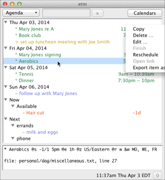
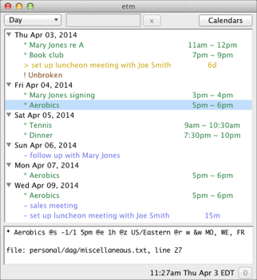

## Screen shots ##

<table align="center" hspace="10" vspace="10" width="100%">
<tr>
    <td>
    </a>
    </td>
    <td>
    </a>
    </td>
</tr>
<tr>
    <td>
    </a>
    </td>
    <td>
    </a>
    </td>
</tr>
<tr>
    <td>
    </a>
    </td>
    <td>
    </a>
    </td>
</tr>
</table>

## Sample entries ##

Items in *etm* begin with a type character such as an asterisk (event) and continue on one or more lines either until the end of the file is reached or another line is found that begins with a type character. The beginning type character for each item is followed by the item summary and then, perhaps, by one or more `@key value` pairs. The order in which such pairs are entered does not matter.

* A sales meeting (an event) [s]tarting seven days from today at 9:00am and [e]xtending for one hour with a default [a]lert 5 minutes before the start:

        * sales meeting @s +7 9a @e 1h @a 5

* The sales meeting with another [a]lert 2 days before the meeting to (e)mail a reminder to a list of recipients:

        * sales meeting @s +7 9a @e 1h @a 5
          @a 2d: e; who@when.com, what@where.org

* Prepare a report (a task) for the sales meeting [b]eginning 3 days early:

        - prepare report @s +7 @b 3

* A period [e]xtending 35 minutes (an action) spent working on the report yesterday:

        ~ report preparation @s -1 @e 35

* Get a haircut (a task) on the 24th of the current month and then [r]epeatedly at (d)aily [i]ntervals of (14) days and, [o]n completion,  (r)estart from the completion date:

        - get haircut @s 24 @r d &i 14 @o r

* Payday (an occasion) on the last week day of each month. The `&s -1` part of the entry extracts the last date which is both a weekday and falls within the last three days of the month):

        ^ payday @s 1/1 @r m &w MO, TU, WE, TH, FR &m -1, -2, -3 &s -1

* Take a prescribed medication daily (a reminder) [s]tarting today and [r]epeating (d)aily at [h]ours 10am, 2pm, 6pm and 10pm [u]ntil (12am on) the fourth day from today. Trigger the default [a]lert zero minutes before each reminder:

        * take Rx @s +0 @r d &h 10, 14, 18, 22 &u +4 @a 0

* Move the water sprinkler (a reminder) every thirty mi[n]utes on Sunday afternoons using the default alert zero minutes before each reminder:

        * Move sprinkler @s 1 @r w &w SU &h 14, 15, 16, 17 &n 0, 30 @a 0

    To limit the sprinkler movement reminders to the [M]onths of April through September each year change the @r entry to this:

        @r w &w SU &h 14, 15, 16, 17 &n 0, 30 &M 4, 5, 6, 7, 8, 9

     or this:

        @r n &i 30 &w SU &h 14, 15, 16, 17 &M 4, 5, 6, 7, 8, 9

* Presidential election day (an occasion) every four years on the first Tuesday after a Monday in November:

        ^ Presidential Election Day @s 2012-11-06
          @r y &i 4 &M 11 &m 2, 3, 4, 5, 6, 7, 8 &w TU

* Join the etm discussion group (a task) [s]tarting on the first day of the next month. Because of the @g (goto) link, pressing Ctrl-G when the details of this item are displayed in the gui would open the link using the system default application which, in this case, would be your default browser:

        - join the etm discussion group @s +1/1
          @g http://groups.google.com/group/eventandtaskmanager/topics

## Installation ##

### Source installation under OS X, Linux or Windows

Python 2.7.x or python >= 3.3.0 is required.

The following python packages are required for etm but are not included in the python standard library:

-   dateutil (1.5 is OK but >= 2.1 is strongly recommended)
-   PyYaml (>= 3.10)
-   icalendar (>=3.5 for python 2, >= 3.6 for python 3)

Tk and the python module tkinter are also required but are typically already installed on most modern operating systems. If needed, installation instructions are given at www.tkdocs.com/tutorial/install.html.

### Installing etm

Download 'etmtk-x.x.x.tar.gz' from this site, unpack the tarball, cd to the resulting directory and do the normal

    sudo python setup.py install

for a system installation. You can then run from any directory either

    $ etm ?

for information about command line usage or

    $ etm

to open the etm gui.

Alternatively, you can avoid doing a system installation and simply run either

    $ python etm ?

or

    $ python etm

or

    $ ./etm

from this directory.

### Installing Mercurial

**Optional but strongly recommended!**

Download Mercurial from

    http://mercurial.selenic.com/

install it and then create the file *~/.hgrc*, if it doesn't already exist, with at least the following two lines:

    [ui]
    username = Your Name <your email address>

Mercurial is used to keep a record of changes to your etm data
files.

### New etm users

By default, etm will use the directory

    ~/.etm

The first time you run etm it will create, if necessary, the following:

    ~/.etm/
    ~/.etm/etmtk.cfg
    ~/.etm/completions.cfg
    ~/.etm/reports.cfg
    ~/.etm/data/

If the data directory needs to be created, then a file `~/.etm/data/sample.txt` will be added with illustrative entries. Similarly, the `*.cfg` files will be populated with useful entries.

### Previous etm users

The first time you run etm, it will copy your current configuration settings from `~/.etm/etm.cfg` to `~/.etm/etmtk.cfg`. You can make any changes you like to the latter file without affecting the former.

You can switch back and forth between etm_qt and etm. Any changes made to your data files by either one will be compatible with the other one.

## Feedback ##

Please share your ideas in the discussion group at [GoogleGroups][].

[GoogleGroups]: http://groups.google.com/group/eventandtaskmanager

## License ##

Copyright (c) 2009-2014 [Daniel Graham]. All rights reserved.

[Daniel Graham]: mailto://daniel.graham@duke.edu

This program is free software; you can redistribute it and/or modify it under the terms of the [GNU General Public License] as published by the Free Software Foundation; either version 3 of the License, or (at your option) any later version.

[GNU General Public License]: http://www.gnu.org/licenses/gpl.html

